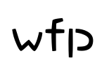

# Hello VuePress
:tada: ！

```ts{1,6-8}
import { defaultTheme, defineUserConfig } from 'vuepress'

export default defineUserConfig({
  title: '你好， VuePress',

  theme: defaultTheme({
    logo: 'https://vuejs.org/images/logo.png',
  }),
})
```

```md
<!-- 默认情况下，这里会被保持原样 -->
1 + 2 + 3 = {{ 1 + 2 + 3 }}
```

```md:no-v-pre
<!-- 这里会被 Vue 编译 -->
1 + 2 + 3 = {{ 1 + 2 + 3 }}
```

```js:no-v-pre
// 由于 JS 代码高亮，这里不会被正确编译
const onePlusTwoPlusThree = {{ 1 + 2 + 3 + 4 }}
```
<!-- 最简单的语法 -->
<!-- @[code md](/images/name.png) -->

